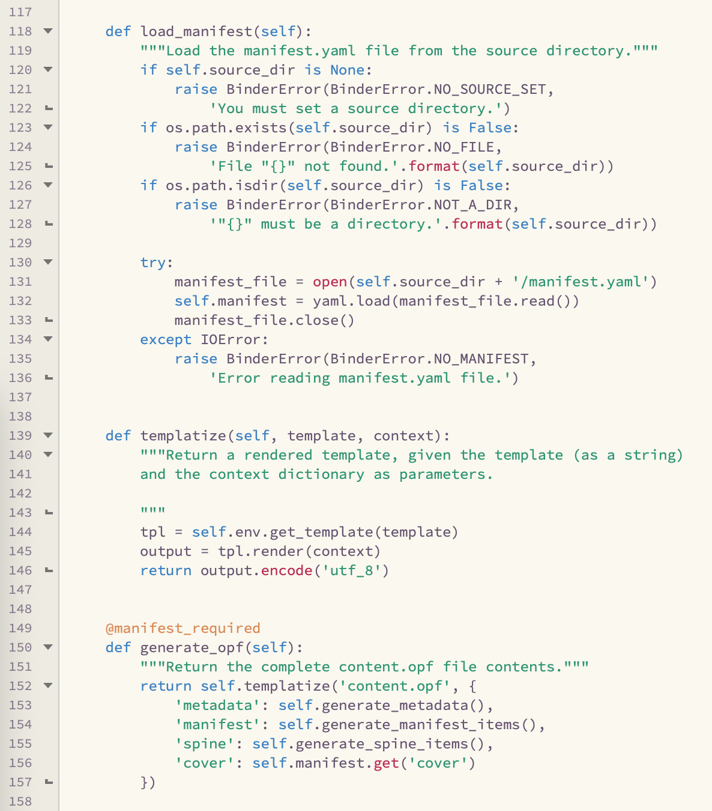

# SpaceBones Color Schemes

Light and dark color schemes for BBEdit inspired by [spacemacs-theme][1], the official themes for the Spacemacs distribution of Emacs.

[1]: https://github.com/nashamri/spacemacs-theme

Most of the colors are taken from spacemacs-theme, but not all. BBEdit and Emacs have very different ideas of default syntax scopes; don't expect the _way_ the colors are used between the two editors to be very similar.

Both schemes cover an identical (and broad) set of syntax scopes, current with BBEdit's known defaults as of release.

## Screenshots

<figure>

<figcaption>SpaceBones Light</figcaption>
</figure>

-----

<figure>

<figcaption>SpaceBones Dark</figcaption>
</figure>

## Installation

1. Put these in the "Color Schemes" folder for BBEdit.
2. Select one of them in the "Text Colors" preference pane.
3. There is no step three.

## Version history

- 2021-07-15: Initial release

## Copyright and etc.

Copyright 2021 Watts Martin. This color scheme is licensed under the MIT License (see accompanying file for details).